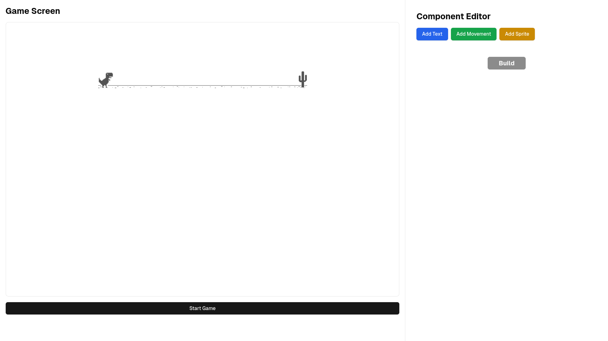
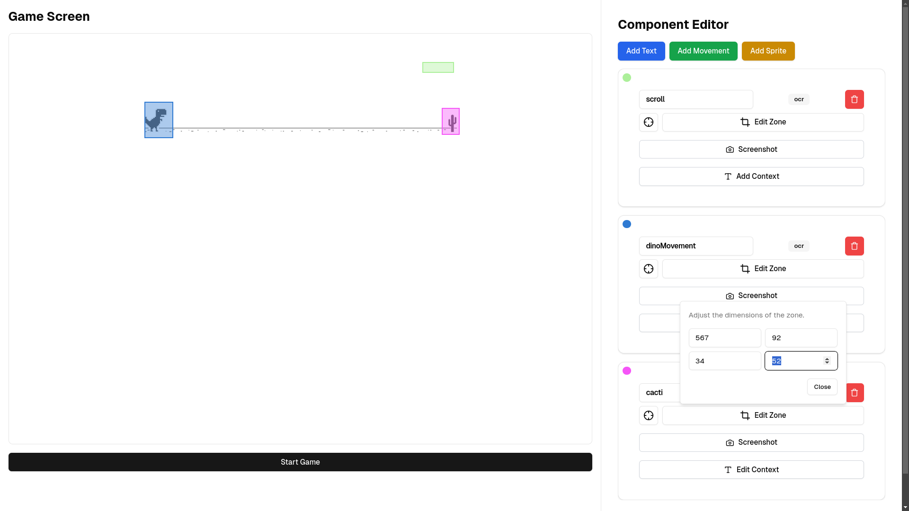
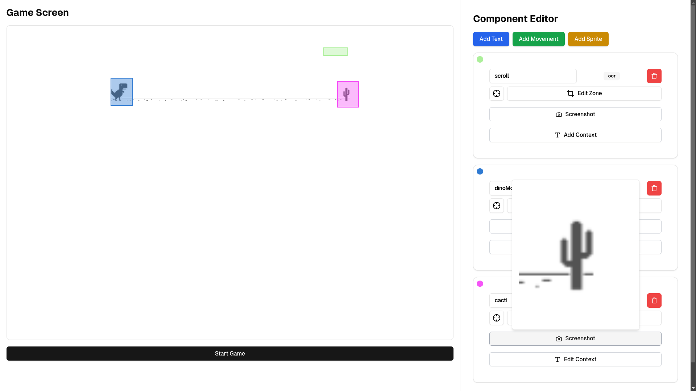
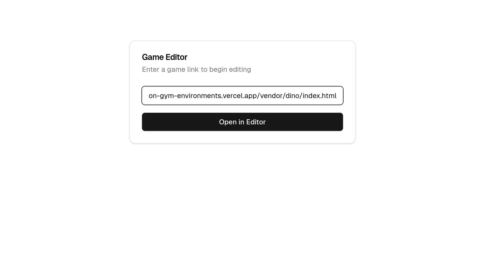
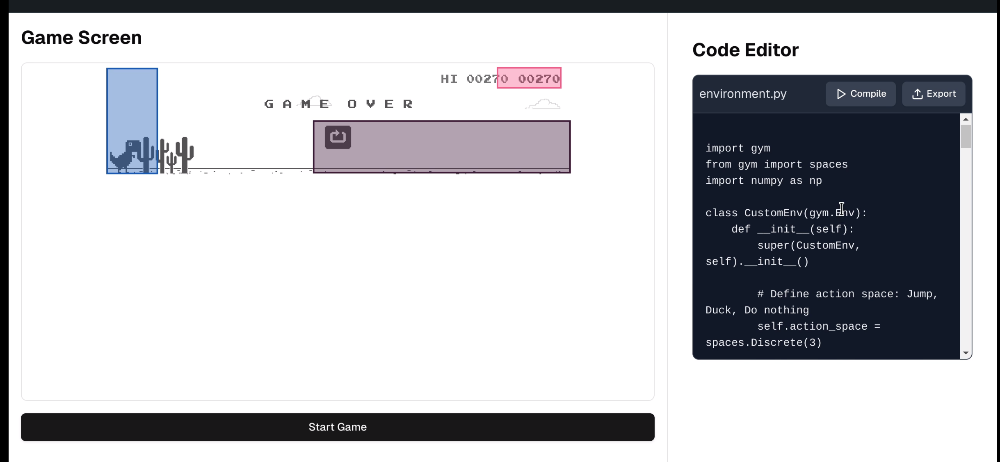

# 🦖 INIT.  2D Game Imitation and Reinforcement Learning Environment

## 🎯 Project Overview

This project is a powerful platform for training AI agents in **2D game environments**, using a combination of **imitation learning** (from human gameplay) and **reinforcement learning**. One of its standout features is a **user-friendly website** that allows users to **easily design and create custom Gym environments** by **drawing components** such as obstacles, actions, and observations.

By making the process of **environment creation** simple and visual, this project bridges the gap between **game developers**, **AI researchers**, and even **non-technical users** who want to experiment with AI in various 2D simulations. In addition, this platform has immense potential for **real-world applications** in fields like **robotics** and **self-driving systems**.

### 🚀 Why This Project?

Traditional AI training requires substantial time and expertise, particularly in defining custom environments and training models. This project aims to democratize AI development for **2D games** and **real-world tasks** by providing:

1. **An accessible environment creation tool**: Users can **draw their own components** (e.g., obstacles, characters, sensors) and define essential parameters for AI training.
2. **Pretraining with imitation learning**: Users can input **human gameplay data** to help agents quickly learn basic behaviors.
3. **Reinforcement learning for optimization**: Once pretrained, agents can further improve through exploration and reward-based learning.

### 🌍 Future Impact

While the project focuses on 2D games, its adaptability extends far beyond that. It lays the groundwork for AI models that can be used in **robotics** and **autonomous systems**, where accurate environment design and human-like decision-making are crucial.

In the future, you can use this platform to:
- Train **robotic arms** to avoid obstacles in dynamic environments.
- Develop **self-driving car models** that learn from human behavior and refine their driving strategies through reinforcement learning.
- Design **real-time decision-making systems** for industrial or automated settings.

## 🎮 Problem Statement

Training AI agents to master 2D games or real-world decision-making tasks involves several challenges:
- **Sparse rewards**: Agents need to navigate environments where feedback is delayed or infrequent (e.g., survival for long periods or completing specific objectives).
- **Complex environments**: Games and real-world tasks present unpredictable obstacles and scenarios, requiring agents to adapt and learn quickly.
- **Efficient learning**: Learning from scratch is computationally expensive. By using **human gameplay data** (imitation learning), we accelerate the learning process.

### 🌟 Solution: Accessible Custom Gym Environment

The environment design tool makes it easy to create tailored scenarios with **simple visual inputs**. Users can draw their custom elements such as:
- **Obstacles**: Position different types of challenges for the agent (e.g., moving or static).
- **Actions**: Define the actions the agent can take, whether it's jumping, dodging, moving, or other behaviors.
- **Observations**: Define the information the agent will see (e.g., distance to obstacles, velocity, and more).

This allows **developers**, **researchers**, and even **novices** to create new environments and simulations without deep technical knowledge.

## 🎮 User Guide: Create Your Custom Gym Environment

Follow these simple steps to create your custom Gym environment:

### 1️⃣ Paste the URL of Any 2D Game on the Web!
- 🖱️ Copy the URL of your favorite 2D game and paste it into the input field.
- 

### 2️⃣ See the Main Page with the Game and Its Settings
- 🎯 You'll now see the game along with all the key settings and options for customization.
- 

### 3️⃣ Draw Attention to Components on the Game Screen
- ✏️ **Component for Extracting Symbols**: Select areas of interest to extract symbols or information.
- 🏷️ **Sprite Component**: Tag obstacles, enemies, or key elements on the game screen.
- 🕹️ **Movement Component**: Mark areas to track the player's position and movements.
- 

### 4️⃣ Record Your Gameplay to Create a Custom Gym Environment
- 🎥 Play the game while our system records your gameplay and learns from your interactions.
- ⏺️ Your actions will be logged to create a personalized Gym environment.
- 

### 5️⃣ Download Your Custom Gym Environment
- 📥 Once the environment is created, you can download it for further use with imitation and reinforcement learning models.
- 🎉 Congratulations! You've built your own Gym environment for AI training.
- 

---

Feel free to reach out if you need any help or have questions! 😊

> Disclaimer: This project can only be meaningfully used by one person at a time, due to the limited system resources. Only the 